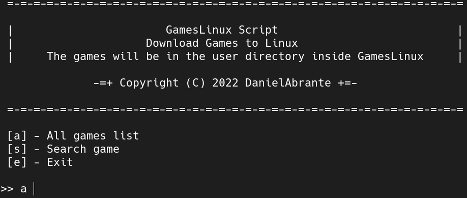
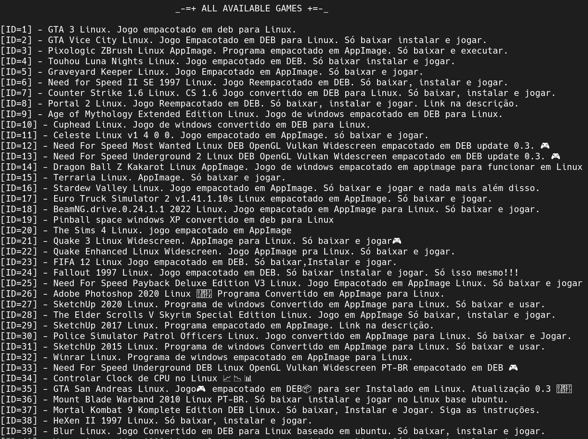
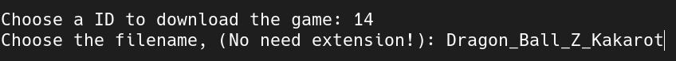

# GamesLinux

## Screenshots
 
 
 
 

## Features
* Download games to Linux from GameLinux channel
* AppImage and .deb formats
* Search for all games available
* Search for specific games available
* Privacy instance to search games
* Privacy download method over manual method

## Official Download

[GitHub Releases](https://github.com/DanielAbrante/GamesLinux/releases/download/v0.3.0/gameslinux.sh)

## Usage 

- Go to directory where downloaded the gameslinux.sh
- Open the terminal and give execute permission: `chmod +x ./gameslinux.sh` 
- To run the script type: `./gameslinux.sh`

## Todo

- [x] Replace method about to search games 

- [x] Add a method to download games when Google Drive emit error message about many access in the url

- [ ] Check dependencies to .deb files in your distro

- [ ] Create a launch to desktop
