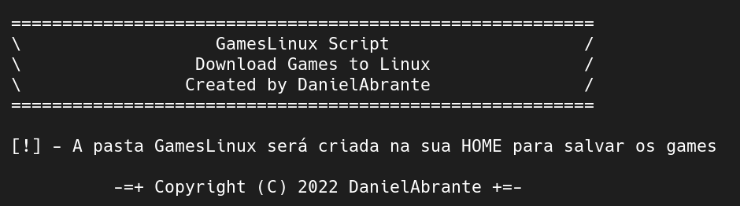

# GamesLinux

</img>

## [ ! ] - Important
**This is a initial basic script, then, many bugs will be encountered**

 

## Installation
- Download the script from release page

 

## **TODO**
- [ ] - Replace method about to search games 
- [ ] - Add a method to download games when Google Drive emit error message about many access in the url
- [ ] - Check dependencies to .deb files in your distro
